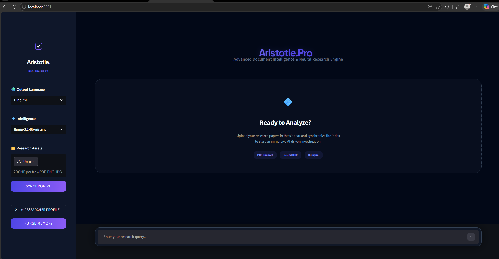

# 💠 Aristotle Pro | Advanced Multilingual AI Research Assistant

[](https://share.streamlit.io/)
[](https://opensource.org/licenses/MIT)
[](https://www.python.org/downloads/)

**Aristotle Pro** is a production-grade, enterprise-ready AI Research Assistant designed to transform complex PDF documents into actionable intelligence. Built with an "Aether" premium dark interface, it leverages Advanced RAG (Retrieval-Augmented Generation) with strict anti-hallucination protocols.

---

## 📸 Platform Preview

<p align="center">
  
</p>

*The Aristotle Pro interface featuring the Aether V2 Design System, centered chat area, and premium research sidebar.*

---

## 🚀 Key Features

- **🎯 Ultra-Strict RAG Architecture**: Zero-hallucination logic ensures answers are derived exclusively from uploaded documents.
- **🌍 Bilingual Intelligence**: Seamlessly switch between professional English and academic Hindi research modes.
- **🔍 Source Transparency**: Perplexity-style citations including PDF filenames, page numbers, and italicized semantic snippets.
- **💠 Aether Pro UI/UX**: A startup-grade, glassmorphism-inspired dark theme with centered content layouts.
- **🛡️ Hardened Security**: Production-ready error handling that suppresses technical stack traces and implementation leaks.

---

## 🏗️ System Architecture

Aristotle Pro is built on a modular, decoupled architecture designed for high-performance research and scalability.

### 🔄 System Workflow


---

## 📂 Project Structure

```text
ai-pdf-chatbot/
├── app.py                # Main Application Entry Point
├── src/
│   ├── chains/           # RAG Chain & Orchestration Logic
│   ├── chunking/         # Text Splitting & Normalization
│   ├── config/           # Global Settings & API Management
│   ├── embeddings/       # Embedding Model Integrations
│   ├── llm/              # LLM Client (Groq/Llama)
│   ├── loaders/          # Document & OCR Parsers
│   ├── memory/           # Persistent Session Memory
│   ├── prompts/          # Anti-Hallucination System Prompts
│   ├── ui/               # Aether Pro Design System & Components
│   ├── utils/            # Translation, Logging & Helpers
│   └── vectorstore/      # FAISS Vector Storage Logic
├── tests/                # Automated Logic Validation
├── logs/                 # Secure System Logging
└── requirements.txt      # Production Dependency Manifest
```

---

## 🛠️ Tech Stack

- **Core**: Python 3.10+
- **Frontend**: Streamlit (Advanced CSS)
- **RAG Framework**: LangChain
- **Database**: FAISS
- **Model**: Groq Llama-3.3-70b
- **Styling**: Vanilla CSS (Glassmorphism)

---

## 👤 Developer

**Bittu Sharma**  
*AI Research Lead & Engineer*  
Building the future of Document Intelligence.

---

<p align="center">
  Built with 💠 by the Aristotle Pro Team
</p>
