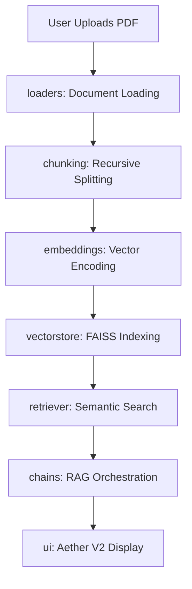

# 💠 Aristotle Pro | Advanced Multilingual AI Research Assistant

[](https://share.streamlit.io/)
[](https://opensource.org/licenses/MIT)
[](https://www.python.org/downloads/)

**Aristotle Pro** is a production-grade, enterprise-ready AI Research Assistant designed to transform complex PDF documents into actionable intelligence. Built with an "Aether" premium dark interface, it leverages Advanced RAG (Retrieval-Augmented Generation) with strict anti-hallucination protocols.

---

## 📸 Platform Preview

<p align="center">
  
</p>

*The Aristotle Pro interface featuring the Aether V2 Design System, centered chat area, and premium research sidebar.*

---

## 🚀 Key Features

- **🎯 Ultra-Strict RAG Architecture**: Zero-hallucination logic ensures answers are derived exclusively from uploaded documents.
- **🌍 Bilingual Intelligence**: Seamlessly switch between professional English and academic Hindi research modes.
- **🔍 Source Transparency**: Perplexity-style citations including PDF filenames, page numbers, and italicized semantic snippets.
- **💠 Aether Pro UI/UX**: A startup-grade, glassmorphism-inspired dark theme with centered content layouts.
- **🛡️ Hardened Security**: Production-ready error handling that suppresses technical stack traces and implementation leaks.

---

## 🏗️ Project Architecture & Design System

Aristotle Pro follows a **Modular Monolith** pattern, ensuring clean separation of concerns and easy extensibility.

### 🔄 System Workflow (RAG Pipeline)


### 🧱 Core Architecture Layers

| Layer | Responsibility | Key Components |
| :--- | :--- | :--- |
| **Presentation** | Multi-page UI & Styles | `src.ui`, `components.py`, `sidebar.py` |
| **Orchestration** | Decision making & Memory | `src.chains`, `chat_memory.py` |
| **Intelligence** | LLM & Inference handling | `src.llm`, `groq_client.py`, `prompts` |
| **Data/Storage** | Document parsing & Vectorizing | `src.vectorstore`, `loaders`, `chunking` |
| **Security** | Stealth mode & Error hardening | `components.py`, `logger.py` |

---

## 📂 Folder Structure

```text
ai-pdf-chatbot/
├── app.py                # Main Application Entry Point
├── src/
│   ├── chains/           # LangChain RAG Logic
│   ├── chunking/         # Text Normalization & Splitting
│   ├── config/           # API Keys & Engine Settings
│   ├── embeddings/       # HuggingFace/Neural Embeddings
│   ├── llm/              # LLM Interface (Groq/Llama)
│   ├── loaders/          # PDF & Image Parsers
│   ├── memory/           # Conversational Context Management
│   ├── prompts/          # Anti-Hallucination Logic (Hindi/English)
│   ├── retriever/        # Vector Store Search Strategy
│   ├── ui/               # Aether V2 Premium Components
│   ├── utils/            # Multilingual Translators & Loggers
│   └── vectorstore/      # FAISS High-Performance Storage
├── phto/                 # Visual Brand Assets
└── requirements.txt      # Production Dependency Manifest
```

---

## 🛠️ Tech Stack

- **Core**: Python 3.10+
- **Framework**: Streamlit (Hardened Stealth Mode)
- **RAG Architecture**: LangChain
- **Vector Engine**: FAISS
- **Inference**: Groq (Llama-3.3-70b-Versatile)
- **Styling**: Vanilla CSS (Aether V2 Design Tokens)

---

## 👤 Developer

**Bittu Sharma**  
*AI Research Lead & Engineer*  
Dedicated to building the future of Document Intelligence.

---

<p align="center">
  Built with 💠 by the Aristotle Pro Team
</p>
